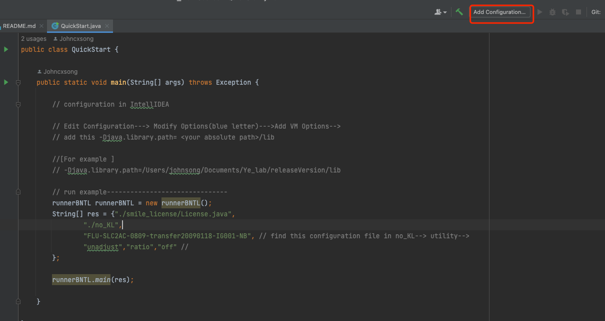
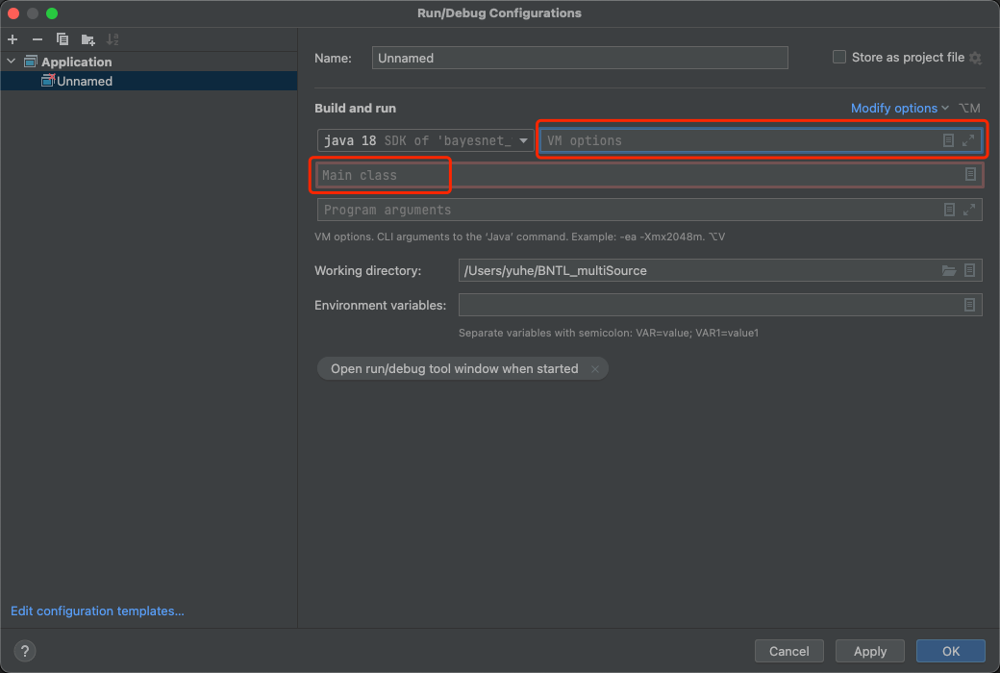
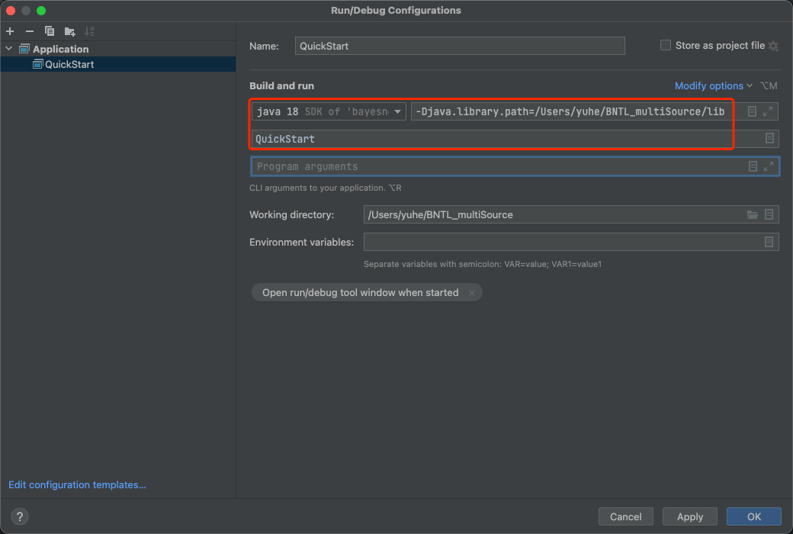
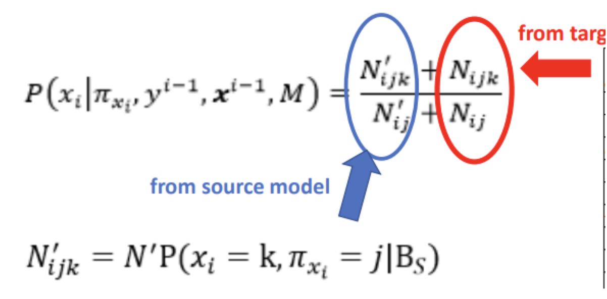
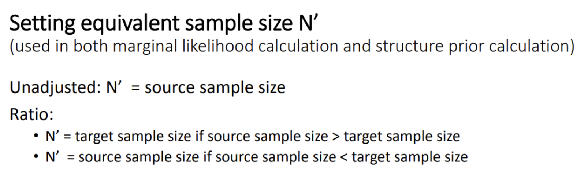
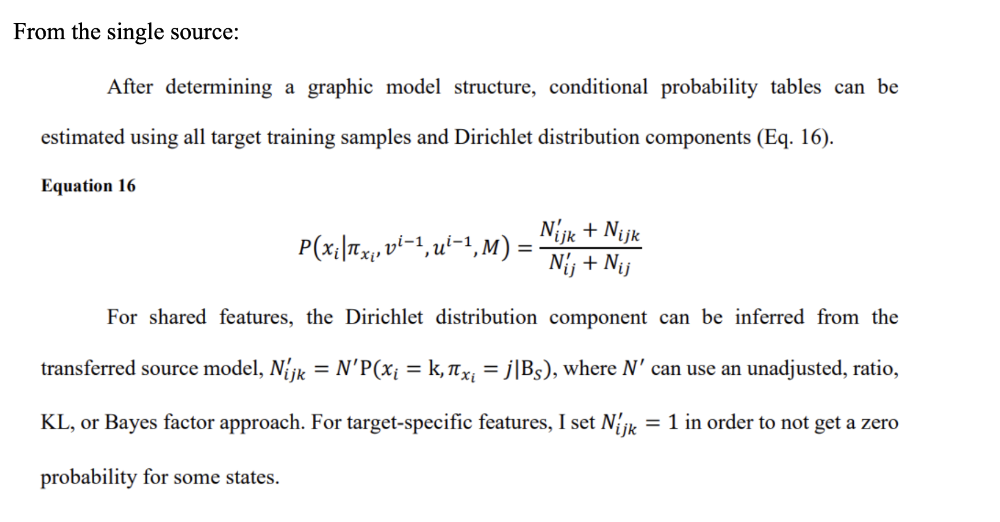
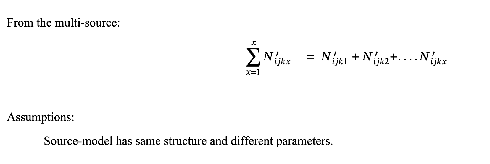

# Bayeisan network transfer learning package 2025 version
# 1. Introduction 

The goal of this project is to increase the re-use of computable biomedical knowledge in probabilistic formalisms.   
In the field of transfer learning, which is a sub-area of machine learning, these differences between settings are referred to as heterogeneity. Unlike traditional machine learning, transfer learning explicitly distinguishes between a source setting, from which we develop a model M that we would like to re-use, and a target setting, for which we use or adapt M, often because the target setting has insufficient data to develop a model de novo. Researchers distinguish transfer learning algorithms by what kinds of heterogeneous transfer learning scenarios (or simply heterogeneous scenarios) they can handle.  

This project created the Bayesian Network Transfer Learning (BN-TL) algorithm to re-use of source model, such as  influenza,  learned from electronic medical record (EMR) data to predict the target data set. (for more info see: *Transfer Learning For Bayesian Case Detection Systems*)

If using this package, please cite this dissertation [Ye, Y., 2019. Transfer learning for Bayesian case detection systems (Doctoral dissertation, University of Pittsburgh.](https://d-scholarship.pitt.edu/35684/)
If having question, contact Dr. Ye Ye through yeyewy@gmail.com

# 2. Quick Start  
*If you have not install JAVA JDK 18 or 1.8 yet, please install first*  

## 2.1 Set Up  
1. `Git clone https://github.com/AI-In-Population-Health-Lab/BNTL_multiSource.git` or download as zip file
2. [download your get 6-month smile key](https://download.bayesfusion.com/files.html?category=Academia) --> put into `smile_license folder`  

## 2.1.1 CLI - Quick Start
1. `cd BNTL current direcotry`  
2. `java -jar Bayesian_network_transfer_learning_2025.jar` ==> this will show the brief instruction of the project.  
3. `java -Djava.library.path=./lib -jar Bayesian_network_transfer_learning_2025.jar ./smile_license/License.java ./config_data_result simulation-data unadjust ratio off`  

## 2.1.2 IntelliJ IDEA  
1. Open BNTL project  
2. Src folder ---> QuickStart.java  
3. Check QuickStart.java comments for configuration to add smile package into library.  
4. Run  

# 3. Run your own models  

## 3.1 Prepare input folder  
- data must be in .arff format.
- model must be in .bif, .xml, .xdsl format.  
### 3.1.1 structure of input folder
	folder_name
		utility
			your configurationFile.txt
		sourceData
			sourceData.arff
		sourceModel
			source_learn_model.bif (you could put multi-models)
		targetData
			target_test_data.arff
			target_train_data.arff
		targetModel
		result
			intermediate folder-->to store result. 
		log

### 3.1.2 parameters for configurationFile.txt

- run unadjust & ratio performance, you need to have Source Part, Target Part, Feature Part, and Path part.
- Run KL options, you need to have KL Part that includes in configuration file. 
- For multi-source processing, `sourceLearnedModelName= 1.bif,2.bif,...`  add `, model.bif`. | `sourceDataSize=1661,1661...` add `number as well`  

# 4. Weighted & Multi-Sources  
## 4.1 Weighted (unadjusted & Ratio)
Searching model process is led by a score. The score is the sum of log marginal likelihood and log structure prior
  

### 4.1.1 Unadjusted Approach
Use sample size of the source training data.
### 4.1.2 Ratio Approach
Use sample size of the target training data.  

Number of target instances / number of source training instances

Weight the source sample size based on the similarity between the target distribution and the source distribution.  If the source and the target distributions are very different, it would be better to assign a lower equivalent sample size for a transferred source model.  

  

## 4.2 Multi-Sources  

  

# 5. Resources  

- [Weka package](https://waikato.github.io/weka-wiki/)  It provides data format structure, the Bayes Network Structure, classifier, evaluation methods.
- [Jsmile package](https://support.bayesfusion.com/docs/Wrappers/)It is encoding the Bayes Network for depth of probability calculation.   

